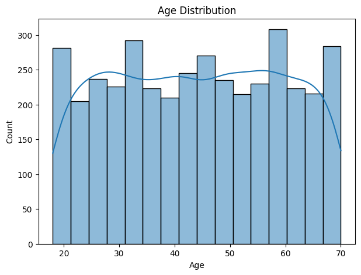
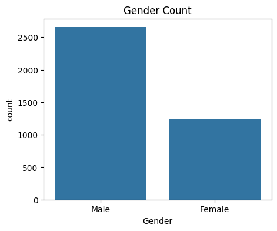
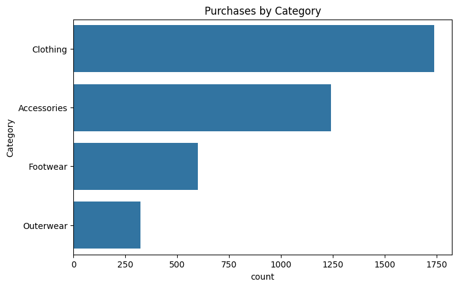
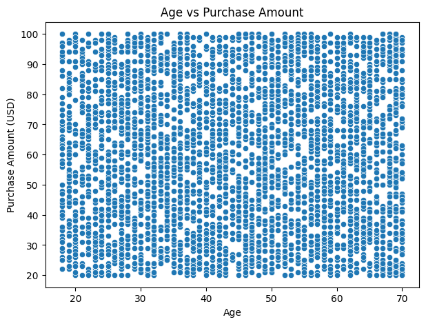
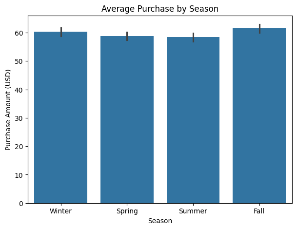
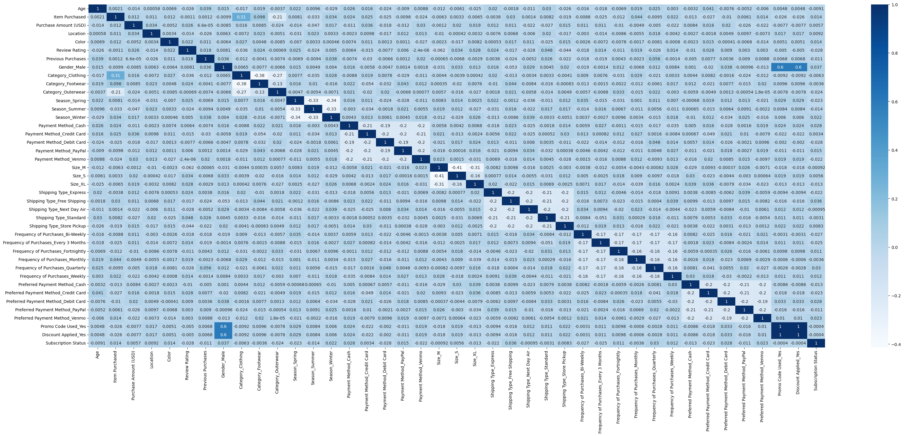
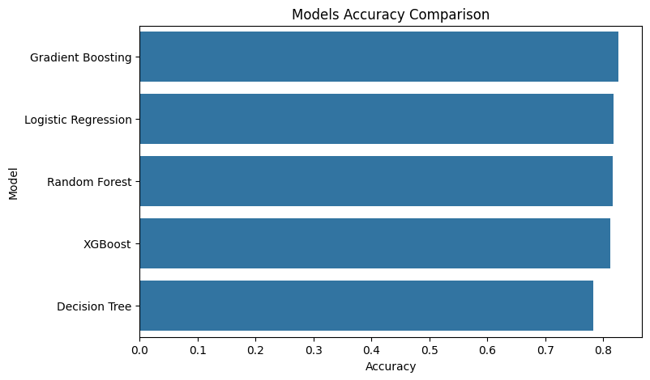

# Shopping Trends Analysis

## Overview
This project analyzes customer shopping trends and purchasing behavior using data analysis and machine learning techniques.

## Project Screenshots

### Data Visualization

## Technologies Used
- Python
- Pandas
- NumPy
- Matplotlib
- Seaborn
- Scikit-learn

## Project Features
- Data Cleaning
- Exploratory Data Analysis (EDA)
- Data Visualization
- Feature Engineering
- Machine Learning Models

## Goals
- Understand customer behavior
- Discover shopping patterns
- Predict trends using machine learning

## Author
Mohamed Ahmed
